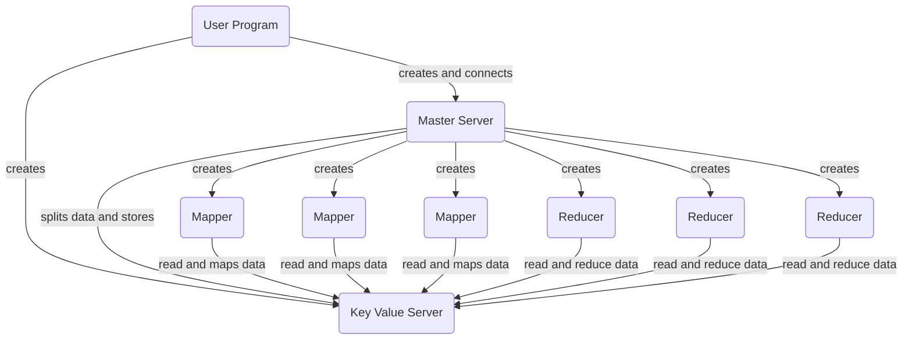

# Distributed Map Reduce

MapReduce is a programming model and an associated implementation for processing and generating large data sets. Users specify a map function that processes a key/value pair to generate a set of intermediate key/value pairs, and a reduce function that merges all intermediate values associated with the same intermediate key. Many real-world tasks are expressible in this model.

Supported tasks are: 

- Word Count
- Inverted Index

## Design

MapReduce applications show their true potential when run on a cluster of commodity machines (*As it is highly scalable*), 

Attributes:

- Master server 
- Key-Value server 
- Mapper Server 
- Reducer Server

##### 1. Master Server:

As the name suggests Master server assigns tasks to mappers, reducers, and key-value storage and gets acknowledgments after completing every task and it also keeps tracks of the logs for any errors or warnings.

##### 2. Key-Value Server:

The Key-value store acts as a database it allocates data to mappers & reducers  and writes their outputs to output files.

##### 3. Mapper:

The Mapper task reads the contents of the corresponding input split. It parses key/value pairs out of the input data and passes each pair to respective reducer files hashing by keys.

##### 4. Reducer:

The Reducers read the intermediate keys allocated to its input split. it passes the key and the corresponding set of values to the user’s Reduce function. and then all the outputs of reducers are combined to form the final output file.

#### Flow Chart




**Extra files :** 

- `config.ini` : To define the ports, task, IP-Address, input file/folder path, etc...
- `run.sh`: This is similar to **User Program** in the original MapReduce to stimulate the MapReduce task.
- `log files`: files generated after every run to track the flow of execution and get notified of any errors and warnings.
- `del.sh`: To delete all the intermediate files created for processing.

### How Does it work?

1. Configure the `config.ini` file according to the requirements (such as port numbers, input file location, etc..)
2. Run `run.sh` bash file. 
3. The Key-Value server gets started.
4. The Master server gets started.
5. Master connects to the Key-Value server and splits the input file according to the number of mappers given.
6. Master then spawns mappers using different `Processes ` to run parallelly mimicking the original MapReduce. 
7. Mappers connect to the master and key-value server and the reads respective input splits and sends it to the map function for further processing.
8. After parsing all the key/value pairs mapper writes the intermediate outputs to the key-value store by hashing each key to their respective reducer inputs.
9. After all the mappers are completed master receives an acknowledgment and spawns reducers to complete the remaining task.
10.  Each reducer processed in parallel reads their respective input splits and combines the value of each key depending on the `function` provided.
11. After completing the task all the reducers write their output to the final_output file at the key-value server and sends an acknowledgment to the master.
12. Master then closes the key-value server and terminates.  
13. Run `del.sh` to remove intermideate files and kill the process if it's still running. (uncomment in the line in `run.sh` file)

Output files : **`wordcount.txt`, `invertindex.txt`**

### How to run Code:

- Go to the project folder.
- Assign the parameters in `config.ini` file.
- Run `sh run.sh` in the terminal.

## Fault Tolerance

- In the current implmentation any error in the program requires the user to restart the application by checking the appropriate log files. 


### Comparisions with original implementation:

|                      Original MapReduce                      |                       Local MapReduce                        |
| :----------------------------------------------------------: | :----------------------------------------------------------: |
|             Fault Tolerance was very effective.              |         You need to restart if there are any errors.         |
| Reducer task sort the intermediate keys from the mapper output applies the reduce function on respective keys. | Mappers outputs are stored using the hash technique (`hash(key)%num_reducers`) to their respective reducers for further reductions. |
| Combiners are used to combine Intermediate data which helps in increasing the speed of reducers and overall application significantly. |             Combiner tasks are not implemented.              |
| No progress bars to track the mapper expect acknowledgment.  | Progress bars to keep track of all the mappers and reducers parallely. |

## Assumptions

- For invertindex number of data files should be equal to number of mappers and reducers
- Only `.txt` files are processed for now.
- Mappers and Reducers are limited to number of cores.
- All the files along with input file/folder need to be located in the same folder.
- Accepected tasks are word count and invert index.

#### Sample Test Cases:

- Tested invert index with same file.

  - sample output was as expected with same count from all mappers (**No data leakage.!**)

    ```python
    the=>{'nutrition2.txt': 2329, 'nutrition1.txt': 2329, 'nutrition.txt': 2329}
    project=>{'nutrition2.txt': 87, 'nutrition1.txt': 87, 'nutrition.txt': 87}
    chemistry=>{'nutrition2.txt': 9, 'nutrition1.txt': 9, 'nutrition.txt': 9}
    of=>{'nutrition2.txt': 1595, 'nutrition1.txt': 1595, 'nutrition.txt': 1595}
    and=>{'nutrition2.txt': 1147, 'nutrition1.txt': 1147, 'nutrition.txt': 1147}
    nutrition=>{'nutrition2.txt': 13, 'nutrition1.txt': 13, 'nutrition.txt': 13}
    is=>{'nutrition2.txt': 749, 'nutrition1.txt': 749, 'nutrition.txt': 749}
    use=>{'nutrition2.txt': 62, 'nutrition1.txt': 62, 'nutrition.txt': 62}
    anywhere=>{'nutrition2.txt': 2, 'nutrition1.txt': 2, 'nutrition.txt': 2}
    no=>{'nutrition2.txt': 73, 'nutrition1.txt': 73, 'nutrition.txt': 73}
    cost=>{'nutrition2.txt': 13, 'nutrition1.txt': 13, 'nutrition.txt': 13}
    almost=>{'nutrition2.txt': 16, 'nutrition1.txt': 16, 'nutrition.txt': 16}
    may=>{'nutrition2.txt': 87, 'nutrition1.txt': 87, 'nutrition.txt': 87}
    copy=>{'nutrition2.txt': 12, 'nutrition1.txt': 12, 'nutrition.txt': 12}
    away=>{'nutrition2.txt': 11, 'nutrition1.txt': 11, 'nutrition.txt': 11}
    license=>{'nutrition2.txt': 16, 'nutrition1.txt': 16, 'nutrition.txt': 16}
    ```

- Invertindex with multiple files.

  - Data is as expected.

    ```python
    project=>{'trouble.txt': 87, 'nutrition.txt': 87}
    ebook=>{'trouble.txt': 11, 'nutrition.txt': 10}
    of=>{'trouble.txt': 271, 'nutrition.txt': 1595}
    double=>{'trouble.txt': 9, 'nutrition.txt': 1}
    carl=>{'trouble.txt': 4, 'nutrition.txt': 1}
    jacobi=>{'trouble.txt': 4, 'nutrition.txt': 0}
    this=>{'trouble.txt': 70, 'nutrition.txt': 200}
    use=>{'trouble.txt': 16, 'nutrition.txt': 62}
    anyone=>{'trouble.txt': 5, 'nutrition.txt': 6}
    anywhere=>{'trouble.txt': 2, 'nutrition.txt': 2}
    ```
  
- Performance.

  - Time taken by the same task with single worker and multiple workers:

    ```python
    # Task is "Word Count".
    >>> Number of reducers = 1
    >>> Number of mappers = 1
    >>> data = 'nutrition.txt'
    17.639039993286133
    
    >>> Number of reducers = 3
    >>> Number of mappers = 3
    >>> data = 'nutrition.txt'
    9.556602001190186
    # We can observe a huge difference for very large files...
    ```

- Error log when the port is already in use.

  - log output

    ```python
    Filename : master.py--Line number: 156--Process is: 3904--Time: 2020-10-12 21:57:55,300--[MapReduce for wordcount is getting started with 3 Mappers 3 Reducers.]
    Filename : master.py--Line number: 161--Process is: 3904--Time: 2020-10-12 21:57:55,300--Connecting KV Store..
    Filename : master.py--Line number: 189--Process is: 3904--Time: 2020-10-12 21:58:01,336--Unable to start the cluster properly check the port numbers properly # Error log 👆
    Filename : master.py--Line number: 123--Process is: 3904--Time: 2020-10-12 21:58:01,336--Killing Key-Value server...!
    Filename : master.py--Line number: 126--Process is: 3904--Time: 2020-10-12 21:58:01,336--Terminating master....!
    Filename : master.py--Line number: 129--Process is: 3904--Time: 2020-10-12 21:58:01,336--Time taken to complete the run is 6.036611080169678
    ```

- `outputs_and_logs`

  - This folder from the submission contains the logs, input/ouput files of the test cases mentioned.